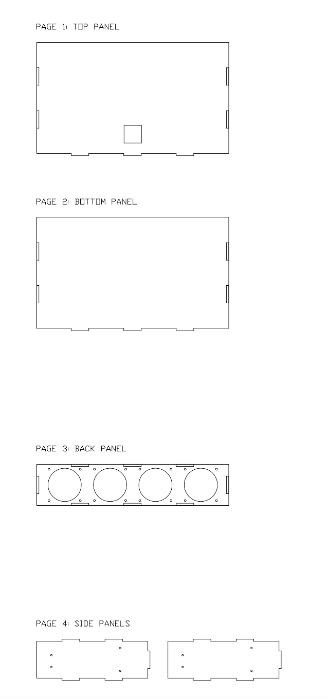

## 📐 CAD 设计文件说明 (CAD Design Files)

本项目包含用于亚克力面板切割的 DXF 原始设计稿及优化迭代版本。

### 1. 核心切割文件

#### 🔹 原始验证版：`Full_Case_Design_Final.dxf`
* **状态：** 已验证。
* **说明：** 本项目首个实物成品即采用此文件进行亚克力板材切割。
* **注意：** 侧板螺丝孔位为 3.0mm 标准孔，对加工精度要求极高，组装时容错率较低。

#### 🔹 推荐迭代版：`HardDrive_Case_V5_3.5mm_Holes.dxf`
* **状态：** 推荐使用。
* **优化：** * **孔径扩增**：将侧板螺丝孔径统一修正为 **3.5mm**，为手动组装预留了必要的物理旷量（Tolerance），有效解决了因公差导致的安装困难。
    * **布局修正**：微调了顶板开孔坐标，解决了原版开孔位置略微偏上的问题，视觉对齐更趋完美。

---

### 🖼️ 设计示意图 (Design Preview)

以下是散热模块及硬盘笼侧板的 CAD 布局参考：

*注：加工前请根据实际使用的亚克力板材厚度，在 CAD 软件中复核榫卯及开孔尺寸。*

---

### 🏗️ 框架结构参考

#### ⚠️ 参考文件：`Server_Rack_Final_Separated.dxf`
* **用途：** 此文件仅作为**铝型材机箱框架的安装逻辑示意图**。
* **警告：** 请勿直接使用此 DXF 文件进行铝型材的切割或下单，框架的具体规格请以项目提供的 [BOM 清单](#)（如有）或实际测量数据为准。
