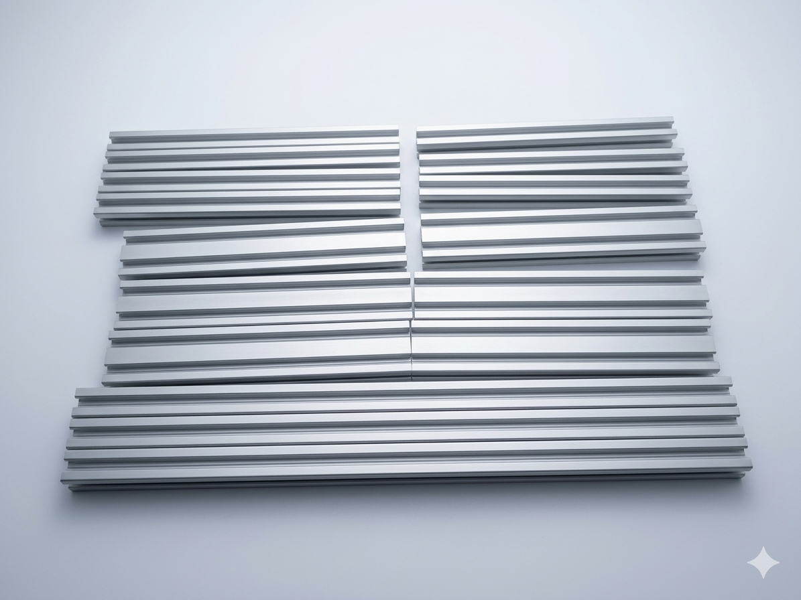

# NEC8_NAS 框架规格书 (Frame Specifications)

本项目 NAS 采用自研铝型材框架结构。本目录提供用于复刻该框架的精确下料清单 (BOM) 和组装技术要求。

## 框架结构插图 (BOM Visual)

*注：图中展示为项目实际切割完成后的型材，带有保护膜，采用中性背景净化处理以突出规格。*

## 铝型材下料清单 (Alu Extrusion BOM)

本项目使用 **2020 欧标 (European Standard)** 和 **2040 欧标** 银色阳极氧化铝型材。

### 1. 2020 规格 (20mm x 20mm)

| 型号 | 长度 (Length) | 数量 (Quantity) | 备注 (Note) |
| :--- | :--- | :--- | :--- |
| **2020** | **440 mm** | **6 根** | 框架纵向长梁 |
| **2020** | **244 mm** | **4 根** | 框架立柱 |
| **2020** | **220 mm** | **3 根** | 硬盘笼/电源横向支撑 |

### 2. 2040 规格 (20mm x 40mm)

| 型号 | 长度 (Length) | 数量 (Quantity) | 备注 (Note) |
| :--- | :--- | :--- | :--- |
| **2040** | **220 mm** | **6 根** | 框架底部/顶部主承重横梁 |

## 连接件与紧固件 (Connectors & Fasteners)

为了追求整体外观的简洁和稳固性，本项目全部采用**内置式角槽连接**。

* **内置角槽连接件** (Inner Corner Connectors)：**共 48 个**。
* **配套紧固螺丝**：配套 48 套（通常随角槽连接件一起出售）。

## 技术要求 (Technical Requirements)

1. **切割精度**：铝型材切割长度公差建议控制在 **±0.5mm** 以内，确保框架组装时的直角度。
2. **切面要求**：切割面必须保证垂直度（Squareness），切忌倾斜，否则会严重影响整体框架的稳定性。

---
[<- 返回项目主页](../README.md) | **Designed by [pub818](https://pub818.com)**
