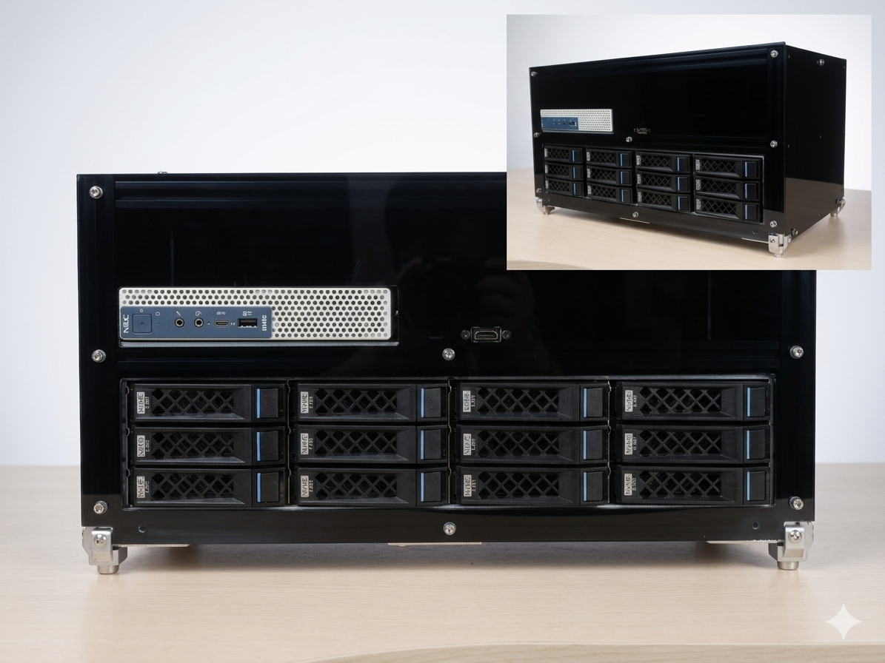

# NEC8_NAS: 12-Bay High-Performance DIY NAS

基于 NEC8 微型主机的 12 盘位高性能 DIY NAS 方案。本项目通过硬件转接与铝型材结构重塑，构建了一个兼顾计算性能与海量存储的家庭实验室中心。

## 核心特性
* **企业级存储能力**：集成 **LSI 9300-8e** HBA 阵列卡，通过外部 Mini-SAS 线缆驱动 **12 盘位勤诚（Chenbro）硬盘笼**。
* **网络带宽升级**：利用 M.2 A-E Key (原 WiFi 接口) 转接 **2.5G 有线网卡 (RTL8125B)**。
* **极限散热优化**：利用转接卡板载 **XH2.54 12V 接口** 为 LSI 阵列卡加装主动散热风扇，解决 9300 系列高温掉盘痛点。
* **全模组供电方案**：采用 **爱国者 (aigo) ES650 金牌全模组电源**，为 12 块硬盘提供稳定的启动电流。
* **自动化同步启动**：集成 **USB 电源同步启动模块**，实现 NAS 主机与硬盘笼电源一键同步开关。
* **自研框架结构**：采用 2020 欧标铝型材 + 自设计亚克力机箱，兼顾稳固与散热风道。

## 硬件清单 (BOM)
| 组件 | 型号/规格 | 备注 |
| :--- | :--- | :--- |
| **主机** | NEC8 (微型主机) | 核心计算单元 |
| **硬盘笼** | 勤诚 (Chenbro) 12 盘位 | 企业级热插拔背板 |
| **HBA卡** | LSI 9300-8e (IT Mode) | 驱动 12 盘位存储 |
| **电源** | 爱国者 ES650 金牌全模组 | 标准 ATX 规格 |
| **启动模块** | USB 电源同步模块 | 解决双电源同步开关问题 |
| **网卡** | M.2 A-E Key 转 2.5GbE | 内网带宽升级 |
| **框架** | 2020/2040 欧标铝型材 | 自研 CAD 结构设计 |

## 设计文件与脚本
本项目包含用于生成机箱板材的脚本与图纸：
* `/Scripts`: 包含自动化生成 DXF 设计文件的 Python 脚本。
    * 支持**无倒角（No Chamfer）**版本，适配自装机箱脚垫。
    * 已优化孔位，移除与电源开口冲突的冗余螺丝孔。
* `/CAD`: 存放最终版 DXF 激光切割/CNC 加工图纸。

## 版权与致谢 (Credits)
* **设计与维护**: [pub818 (帕步科技)](https://pub818.com)
* **创作理念**: **Designed by Human · Assisted by AI**
* **许可协议**: 本项目遵循 [MIT License](./LICENSE) 开源。

---
*更多详细的装机心路历程与软件配置，请参考我的个人博客：[pub818.com](https://pub818.com)*
